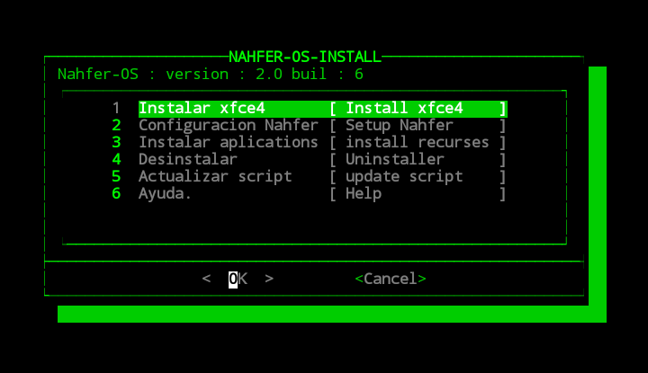
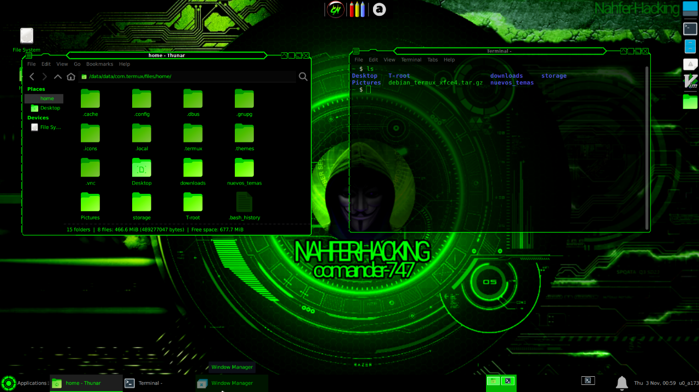
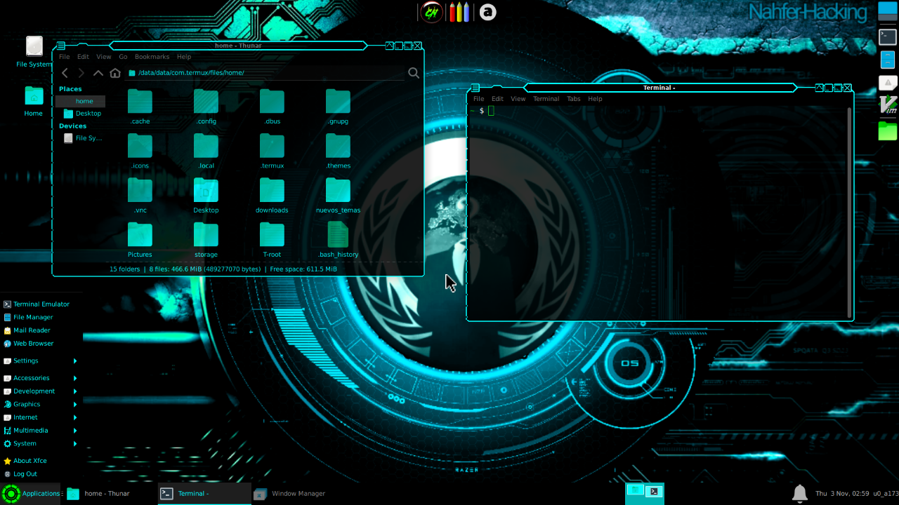
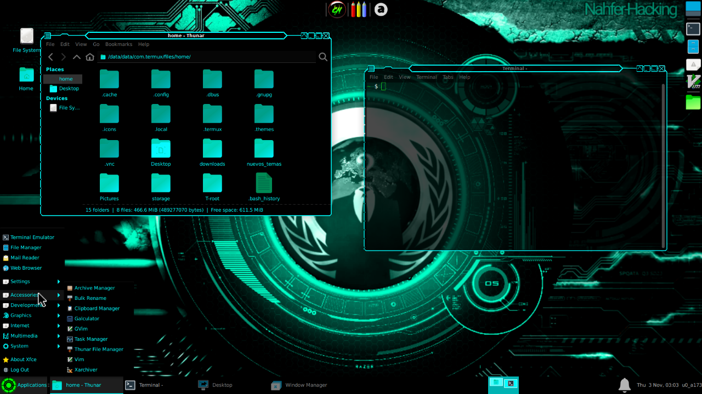
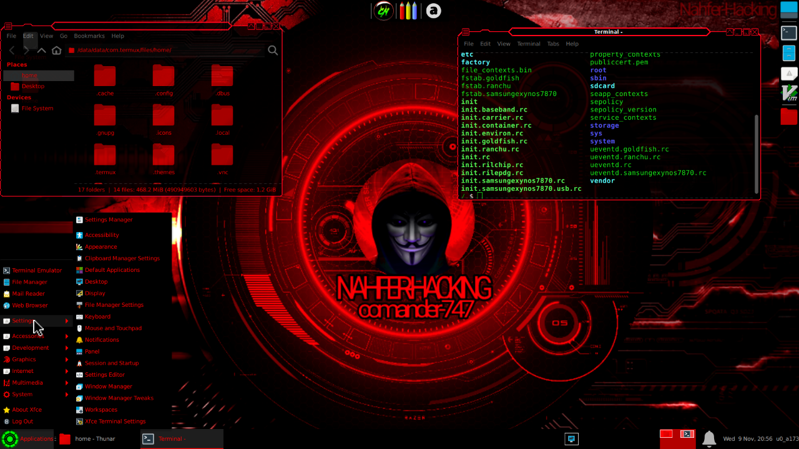
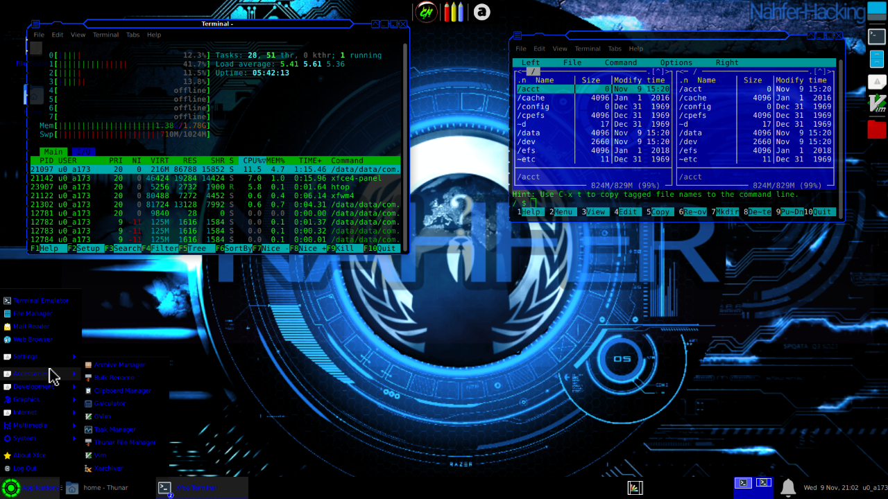
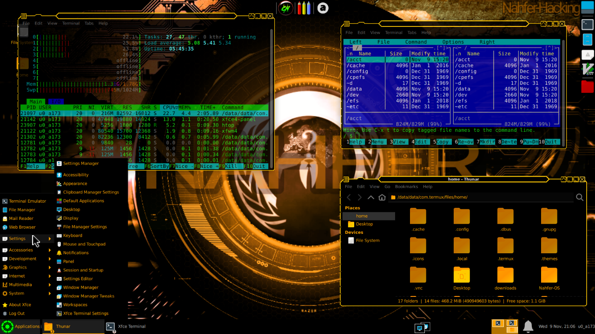
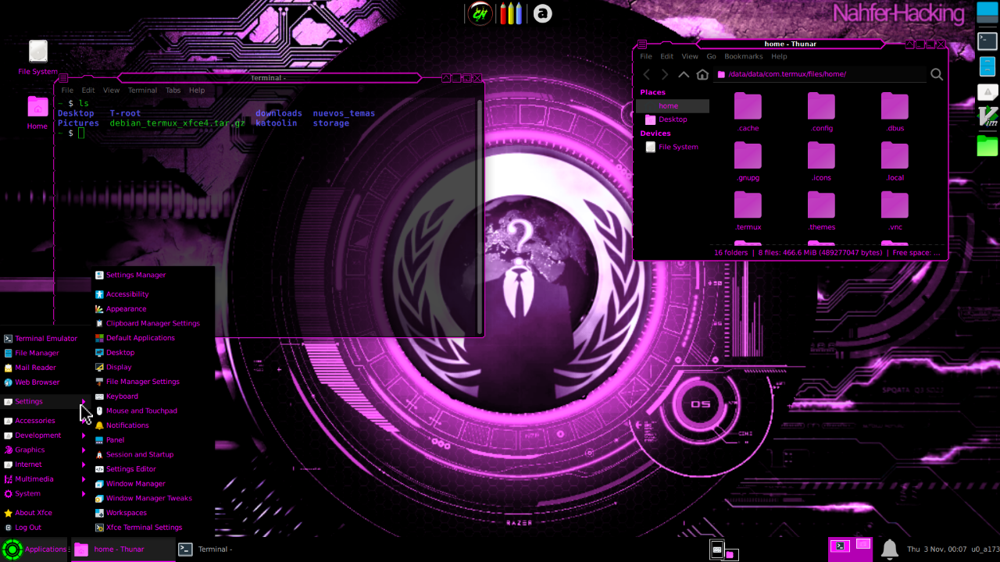

<!DOCTYPE html>
<html>
<head>
<body bgcolor=black text=lime>

<h1> Nahfer-OS </h1> 
<h5> Nahfer-OS es un parche de escritorio xfce4 de distribuciones basadas en
Debian</h5> 
<h5> Es compatible en Distribuciones basadas en debian 
y Termux.</h5> 
 
 
 
 
 

 

</body></head></html>
